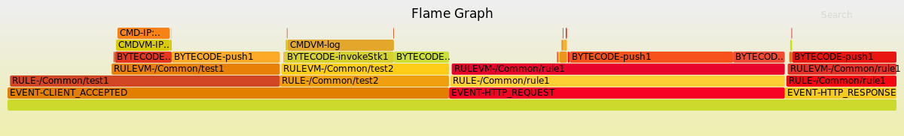

# iRuleLogAPI

This API is designed to convert iRule profiler log data into FlameGraphs. It
includes various options for filtering and displaying said FlameGraphs. Below is
a real example. Displayed is a snippet of the log file the displayed Flame Graph
was created from.<br>



1\. Requirements/Compatibilty
==============
Requirements:
1. Python 3
2. Perl
3. Linux Environment

2\. How To Use
==============
1. Clone the repository
2. Import and call methods through the following
```python
from irulelogapi import flaminglog
flaminglog.methodname()
```

# TODO: get methods and document them
3\. Method Documentation 
========================
1. TBD


4\. Use Examples
================
The following are some examples of typical and expected uses for the API<br>

##### Creating Flame Graphs for a single input log file. No filters
Calling make\_svg with a single input creates 2 Flame Graphs:
1. `static/myflame1Combined.svg`: Shows all like occurrences with same occ-value
   combined for the first input
2. `static/myflame1Separate.svg`: Show all occurrences as separate boxes in the
   Flame Graph for the first input

```python
from irulelogapi import flaminglog

myLogFile = "LogDir/logfile.txt"
outName, outList, errorCode = flaminglog.make_json(myLogFile)

exitBool, fileDict = flaminglog.make_svg(outList)
```

##### Creating Differential Flame Graphs with 2 input files. No filters
Calling make\_svg with 2 inputs creates 7 Flame Graphs. All are created in
`static/`. They are the following:
1. `static/myflame1Combined.svg`: Shows all like occurrences with same occ-value
   combined for the first input
2. `static/myflame1Separate.svg`: Show all occurrences as separate boxes in the
   Flame Graph for the first input
3. `static/myflame1Combined.svg`: The same as myflame1Combined only with the
   data from the second input 
4. `static/myflame1Separate.svg`: The same as myflame1Combined only with the
   data from the second input
5. `static/diff1.svg`: Shows myFlame1Combined colored to show how preformance
   compares to the 2nd input. Blue for better Red for worse.
6. `static/diff2.svg`: Shows myFlame2Combined colored to show how preformance
   compares to the 1st input. Blue for better Red for worse.
7. `static/onlydiff.svg`: Shows only the occurrences where performance changed.
   Displays the widths and colors based on data input 2
Note that the beforeLog must be the first input in make\_svg() and after log
must be the second input. Additionally, make\_svg takes the list output from
make\_json() as its inputs.
```python
from irulelogapi import flaminglog

beforeLog = "LogDir/log1.txt"
afterLog = "LogDir/log2.txt"

beforeName, beforeList, beforeError = flaminglog.make_json(beforeLog) 
afterName, afterList, afterError = flaminglog.make_json(afterLog) 

exitBool, fileDict = flaminglog.make_svg(beforeList, afterList)
```

##### Filtering occurrence types using make\_json()
If any filtering by the occurrence type is desired it must be done by passinga
list of the filters one wants kept in the data to make\_json().
```python
from irulelogapi import flaminglog

myLogFile = "LogDir/logfile.txt"

typeList = ['EVENT', 'RULE', 'CMDVM', 'CMD']
outName, outList, errorCode = flaminglog.make_json(myLogFile, typeList)
```

##### Using filter\_json()
filter\_json() requires the data to be filtered in list form and a query string.
The format of this query string is very strict and must be as follows:<br>
`(fieldname1==value1)operator(fieldname2==value2)...`<br>
Accepted values for fieldname include:
1. eventval: EVENT to which an occurrence belongs. Determined by the occ-value
   of an occurrence's parent EVENT
2. irule: The iRule to which an occurrence belongs. EVENTs do not belong to any
   iRule.
3. remote: The source destination address of the connection for that occurrence.
   Values must follow this format: `ipaddr:portnumber:routingdomain`
4. local: The remote destination address of the connection for that occurrence 
   Values must follow this format: `ipaddr:portnumber:routingdomain`
5. flow: A combination of remote and local addresses
   Values must follow this format: `remoteAddrFormat-localAddrFormat`

The following operators are supported to combine logic:
1. OR: `|`
2. AND: `&`

Using these formatting requirements a typical query string may look like any of
the following:<br>
`(eventval==HTTP_REQUEST)|(eventval==CLIENT_ACCEPTED)`<br>
`(remote==10.10.10.162:88:0)`<br>
`(flow==10.10.10.162:88:0-10.0.27.240:44:0)&(irule==/Common/rule1)`<br>

Note all occurrences which meet the crtitera of the query string or contain a child
occurrence which passes the criteria will be included in the output of
filter\_json(). This means that if one only wants occurrences which occurr in an
iRule then even though EVENTs can't belong to an iRule all EVENTs which contain
any children within the desired iRule will also be present in the output of
filter\_json()

##### Filtering by a value using filter\_json()
```python
from irulelogapi import flaminglog

myLogFile = "LogDir/logfile.txt"
outName, outList, errorCode = flaminglog.make_json(myLogFile)

myFilterStr = "(eventval==HTTP_REQUEST)"

filteredList = flaminglog.filter_json(outList, myFilterStr)
```

##### Filtering by multiple values filter\_json()
Only occurrences which are in an HTTP\_REQUEST EVENT and are in iRule
/Common/myrule1 or have a child which meets this criteria will be present in
filteredList
```python
from irulelogapi import flaminglog

myLogFile = "LogDir/logfile.txt"
outName, outList, errorCode = flaminglog.make_json(myLogFile)

myFilterStr = "(eventval==HTTP_REQUEST)&(irule==/Common/myrule1)"

filteredList = flaminglog.filter_json(outList, myFilterStr)
```

##### Filter by Multiple Values using the run\_multiple\_filters() method
run\_multiple\_filters() accepts a dicitonary of keys which match the accepted
fieldnames of filter\_json(). The values of the keys should be the formatted
query string. run\_multiple\_filters() calls filter\_json() once for each
fieldname and feeds the reuslt of that call back into then next call until each
key from the input dictionary has been done. This is equivalent to ANDing the
results of each call together. The recommended use is to only combine query
strings within the passed dict using OR. See below
```python
from irulelogapi import flaminglog

myLogFile = "LogDir/logfile.txt"
outName, outList, errorCode = flaminglog.make_json(myLogFile)

filterDict = {
    eventval: None,
    irule: "(irule==/Common/rule1)|(irule==/Common/otherrule)",
    remote: "(remote==10.10.10.162:88:0)",
    local: "(local==10.0.0.25.62:44:0)|(local==10.0.0.98.0:44:0)",
    flow: None
}

resultList = flaminglog.run_multiple_filters(filterDict, outList)
```
In the above example the resulting list will only feature occurrences which are
in either (/Common/rule1 OR /Common/otherrule) AND (have the above remote
address) AND (have either of the above local addresses). No filtering occurrs
on eventval or flow since they are both None.

##### Using parse\_filter\_dict()
parse\_filter\_dict() was created to take a dictionary containing valid fieldnames
from filter\_json() for keys and a list of strings in the form of a string
itself and converting the values into valid query strings for filter\_json(). It
returns a dictionary with the same keys but the values have been parsed into
valid query Strings. This method is meant for converting the String list format
of flask into something useable by filter\_json()
```python
from irulelogapi import flaminglog

myLogFile = "LogDir/logfile.txt"
outName, outList, errorCode = flaminglog.make_json(myLogFile)

filterDict = {
    eventval: "[]",
    irule: "['Common-rule1','Common-otherrule']",
    remote: "['10.10.10.162:88:0']",
    local: "['10.0.0.25.62:44:0','10.0.0.98.0:44:0']",
    flow: "[]"
}

goodFilterDict = flaminglog.parse_filter_dict(filterDict)

resultList = flaminglog.run_multiple_filters(goodFilterDict, outList)
```

##### Running a filter with multiple input files
When creating differential Flame Graphs and using filters the same filters must
be used on both data sets


```python
from irulelogapi import flaminglog

beforeLog = "LogDir/log1.txt"
afterLog = "LogDir/log2.txt"

beforeName, beforeList, beforeError = flaminglog.make_json(beforeLog) 
afterName, afterList, afterError = flaminglog.make_json(afterLog) 

filterDict = {
    eventval: None,
    irule: "(irule==/Common/rule1)|(irule==/Common/otherrule)",
    remote: "(remote==10.10.10.162:88:0)",
    local: "(local==10.0.0.25.62:44:0)|(local==10.0.0.98.0:44:0)",
    flow: None
}

resultListBefore = flaminglog.run_multiple_filters(filterDict, beforeList)
resultListAfter = flaminglog.run_multiple_filters(filterDict, afterList)

exitBool, fileDict = flaminglog.make_svg(resultListBefore, resultListAfter)
```

##### Convert Flame Graph svg file to png image file
Assuming make\_json() and filter\_json() have already been run the following
example converts all svg files to png and names them with the same name but a
different extension. It checks for None because if the file is not created
during the make\_svg() then the value in fileDict is None


```python
from irulelogapi import flaminglog

exitBool, fileDict = flaminglog.make_svg(resultListBefore, resultListAfter)

for key in fileDict:
    if(fileDict[key] is not None)
        flaminglog.svg_to_png(key, key[:-3]+"png")
```

##### File Management
Use cleanup() and remove\_png\_files() to delete files between each set of calls
to the API. Calling remove\_png\_files() with "static" as the input deletes all
png files in the static directory.


```python
from irulelogapi import flaminglog

flaminglog.cleanup()
flaminglog.remove_png_files("static")

beforeLog = "LogDir/log1.txt"
afterLog = "LogDir/log2.txt"

beforeName, beforeList, beforeError = flaminglog.make_json(beforeLog) 
afterName, afterList, afterError = flaminglog.make_json(afterLog) 

filterDict = {
    eventval: None,
    irule: "(irule==/Common/rule1)|(irule==/Common/otherrule)",
    remote: "(remote==10.10.10.162:88:0)",
    local: "(local==10.0.0.25.62:44:0)|(local==10.0.0.98.0:44:0)",
    flow: None
}

resultListBefore = flaminglog.run_multiple_filters(filterDict, beforeList)
resultListAfter = flaminglog.run_multiple_filters(filterDict, afterList)

exitBool, fileDict = flaminglog.make_svg(resultListBefore, resultListAfter)


for key in fileDict:
    if(fileDict[key] is not None)
        flaminglog.svg_to_png(key, key[:-3]+"png")
```

##### Getting Error Messages
To get descriptive error messages for invalid inputs that shouldn't cause a hard
error use handle\_error

```python
from irulelogapi import flaminglog

myLog = "LogDir/log.txt"
outName, outList, errorCode = flaminglog.make_json(myLog)

errorMessage = flaminglog.handle_error(errorCode)
```


5\. Testing
===========
The API has a full suite of tests written using the python unittest framework.
###### To run full suite do the following:<br>
1. Navigate to the root directory of the repo `irulelogapi/`
2. Run the following: `# python -m apitests.run_all_tests`<br>
This will run the full suite of tests for the entire API. Test must be run in a
Linux environment.<br>
###### To run tests for a single method:
1. Navigate to the root directory of the repo `irulelogapi/`
2. Run the following: `# python -m apitests.test_methodname`<br>
###### To run a single test from a single method:
1. Navigate to the root directory of the repo `irulelogapi/`
2. Run the following: `# python -m apitests.test_methodname TestMethodNameNoUnderscores.test_name`<br>
See individual test files for test\_names
###### Tests Options/Settings
A few options are available to change test behavior through the use of
environment variables.
1. TEST\_VERBOSITY: Changes the amount/frequency of printouts to console
2. TEST\_INPUT\_FILE: For tests without a hardcoded input file the input file
   can be changed. The input file must always be an iRule log file in .txt
   format
3. TEST\_RUN\_NUMBER: Some tests such as for the type filter on make\_json() and
   the filter\_json() tests run through a random input to the filter and log any
   failures. The number of times a random input is tested is specifed using this
   environment variable. Default number is 1<br>
To run a test with any of these options:<br>
`# TEST_VERBOSITY=0 TEST_INPUT_FILE=LogDir/mylog.txt TEST_RUN_NUMBER=100 python3
-m apitests.run_all_tests`


